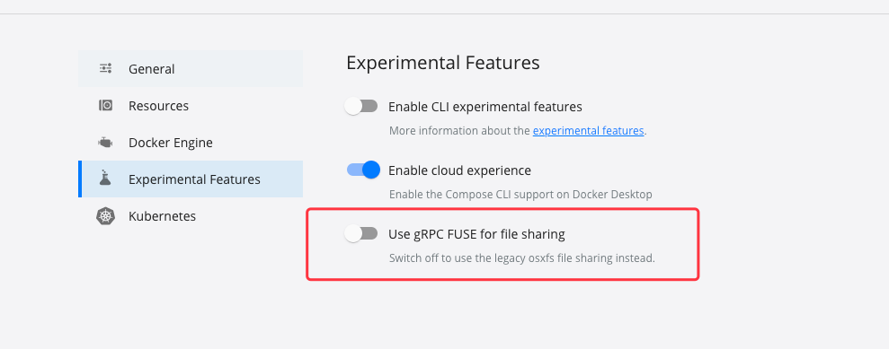

IBM blockchain Platorm 主要是一个vscode插件

先写配置文件

```
fabric:
  cas:
  - "ca.bc1.example.com"
  - "ca.bc2.example.com"
  peers:
  - "p1.bc1.example.com"
  - "p1.bc2.example.com"
  orderers:
  - "orderer1.example.com"
  settings:
    ca:
      FABRIC_LOGGING_SPEC: INFO
    peer:
      FABRIC_LOGGING_SPEC: INFO
    order:
      FABRIC_LOGGING_SPEC: INFO
  goproxy: "https://goproxy.cn,direct"
```

然后启动具体版本 ./minifab up -i 2.3.0 -o bc1.example.com -e

mac高版本启动需要修改docker配置。否则会有一个错误。



-o 是指定默认组织
-e 是指定对外暴露

默认创建的是mychannel

然后启动起来了:

```
# Discover endorsers results **********************************
  Chaincode endorsers file: ./vars/discover/mychannel/simple_endorsers.json
# Discover orderers results ***********************************
  Channel orderers file: ./vars/discover/mychannel/ordererendpoints.json

# STATS *******************************************************
minifab: ok=358	failed=0

real	5m26.769s
user	2m42.134s
```

启动区块链浏览器 ./minifab exploreup

./minifab query -p '"query", "a"'

使用-n 链码名 调用别的合约

./minifab invoke -p '"invoke", "a", "b", "10"'

创建channel

./minifab create -c 名字
./minifab join 加入网络
./minifab query 签名前需要调用
./minifab channelsign 签名， 这个地方有错误
在第二集4分50S修改channel 配置，然后重新签名，再update
./minifab channelupdate

注意修改var需要root用户

安装链码

./  install -n sampleCC(在var chaincode目录下)
./ approve
./ commit
./ -initiaize

容器启动起来，物理机ping不通docker的IP地址，可以使用
https://www.cnblogs.com/luo-c/p/15830769.html
另外注意配置文件，重启minifabric的时候容器IP会变动

查看容器所有IP:

$ docker inspect --format='{{.Name}} - {{range .NetworkSettings.Networks}}{{.IPAddress}}{{end}}' $(docker ps -aq)
/dev-peer0.org1.example.com-simple_1.0-9f3cb6e6005e8d60de01867e01d785ddf3b969869223a87107792a9614841f26 - 172.20.0.7
/dev-peer1.org2.example.com-simple_1.0-9f3cb6e6005e8d60de01867e01d785ddf3b969869223a87107792a9614841f26 - 172.20.0.6
/267d929524_cli - 172.20.0.5
/orderer.example.com - 172.20.0.4
/peer1.org2.example.com - 172.20.0.3
/peer0.org1.example.com - 172.20.0.2
/connector -

调用链码的时候要自己在命令行先quey一下


SDK:

ENDORSEMENT_POLICY_FAILURE. Description: instantiateOrUpgradeCC failed
